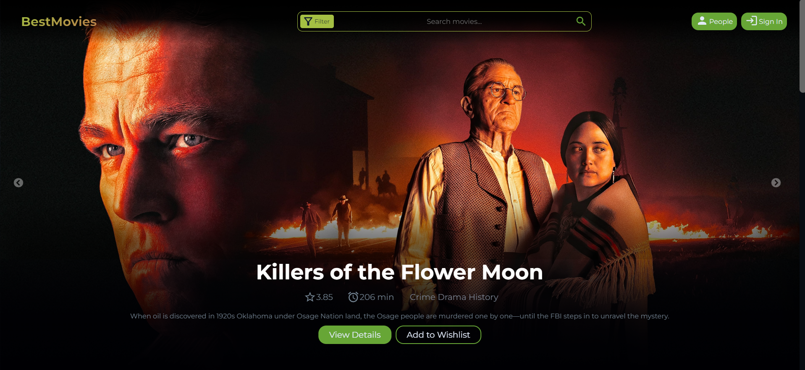
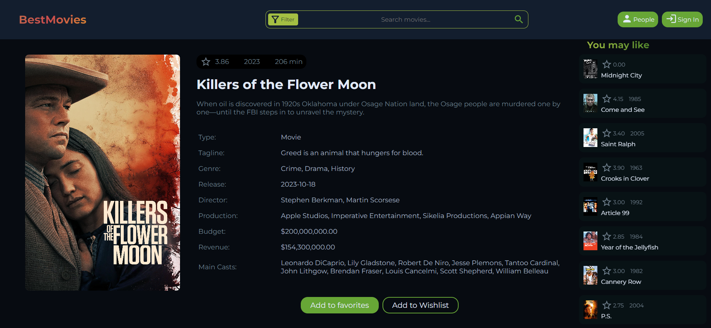
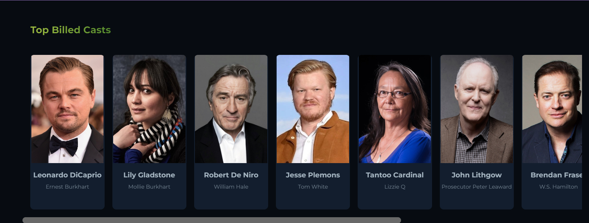
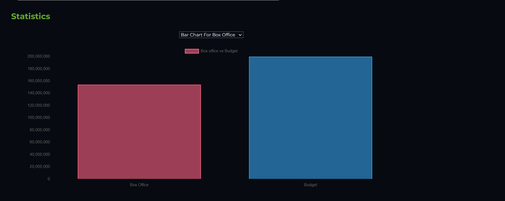
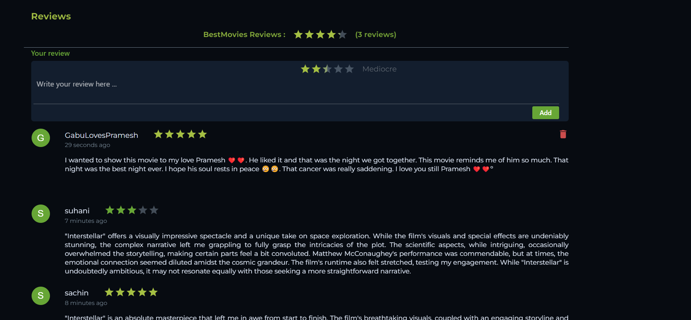

# Best Movies: 6th semester project
### Authors:
 - **[Sachin Baral](https://github.com/MrSachin7)**
 - **[Himal Sharma](https://github.com/himal28924)**



## Introduction to the project
This project constitutes a vital component of our 6th-semester coursework,
presenting a dedicated movie review website.
The platform empowers users to contribute their movie reviews and explore critiques from fellow users.
Additionally, it incorporates a robust search functionality enabling users to discover movies and apply filters based on 
language, and release year. Notably, users can curate personalized watchlists and favorite lists,
enhancing their interaction with the platform. This website caters to cinephiles seeking an interactive and feature-rich environment for both reviewing and enjoying movies.
Users can also view the statistics of different movies and actors.

[Enjoy our web-application here](https://bestmovies-sep6.github.io/frontend/#/)

## Contributing to our project

We welcome contributions from the community to enhance and improve our movie review website. If you'd like to contribute, please follow these steps:

1. **Fork the Repository:** Click on the "Fork" button on the top right of this repository to create your own copy.
2. **Clone Your Fork:** Clone the repository to your local machine using the following command:
   ```bash
   git clone https://github.com/bestmovies-SEP6/frontend.git
    ```
3. **Create a New Branch:** Create a new branch using the following command:
    ```bash
    git checkout -b new-branch-name
    ```
4. **Make Changes:** Make changes to the code base to implement the changes you'd like to see.
5. **Commit Changes:** Commit your changes using the following commands:
    ```bash
    git add .
    git commit -m "your-commit-message"
    ```
6. **Push Changes:** Push your changes using the following command:
    ```bash
    git push origin new-branch-name
    ```
7. **Submit a Pull Request:** Go to your fork on GitHub and click on "Compare & pull request." Then add a title and description to your pull request that explains your contribution. Finally, submit the pull request.
8. **Congratulations!** Sit back and relax while your pull request is reviewed and merged.

## Project Structure
The project is divided into two parts: frontend and backend.
The frontend is developed using React.js and the backend is developed using ASP.NETcore.
The frontend and backend are connected using RestApi.
The frontend is deployed on GitHub Pages and the backend is deployed on Google Cloud.

[Checkout our backend repository here](https://github.com/bestmovies-SEP6/backend)

### Here are some screenshots of our project for your reference:





